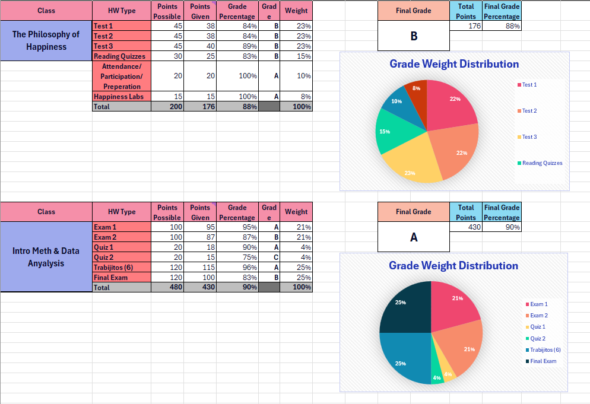
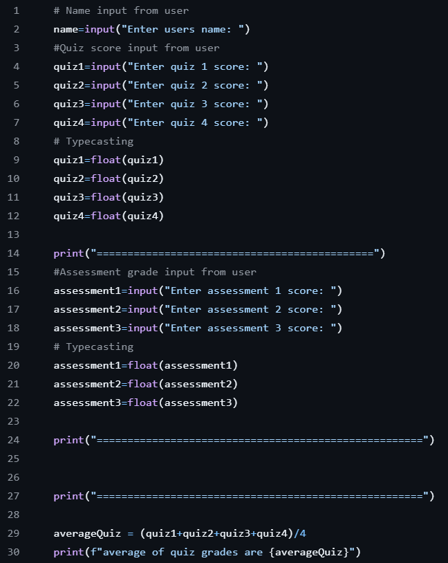
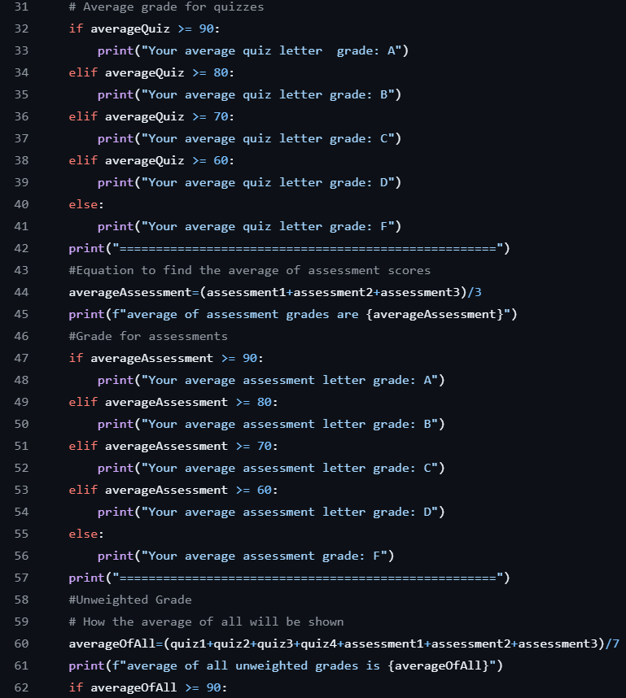
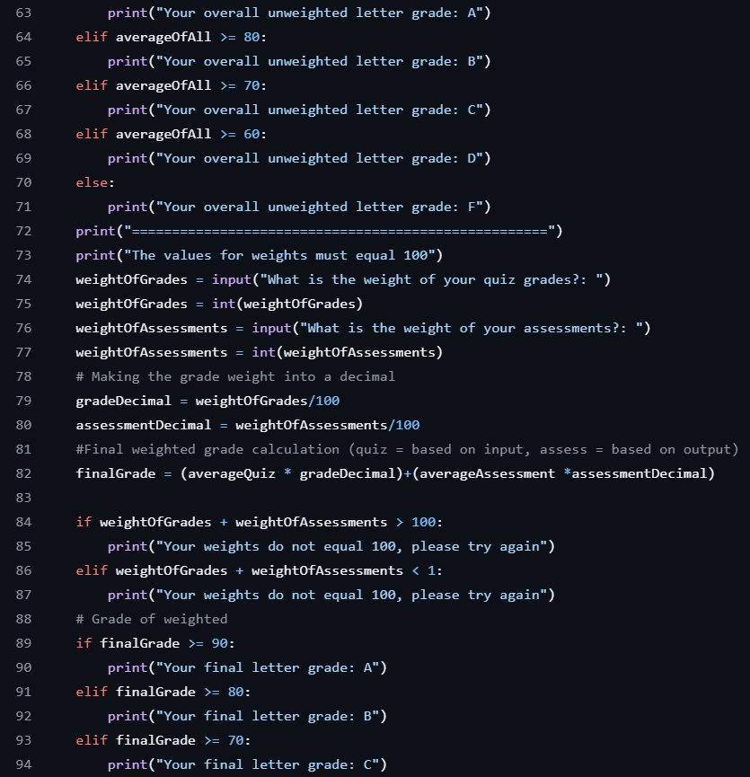
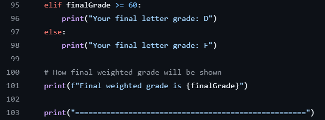
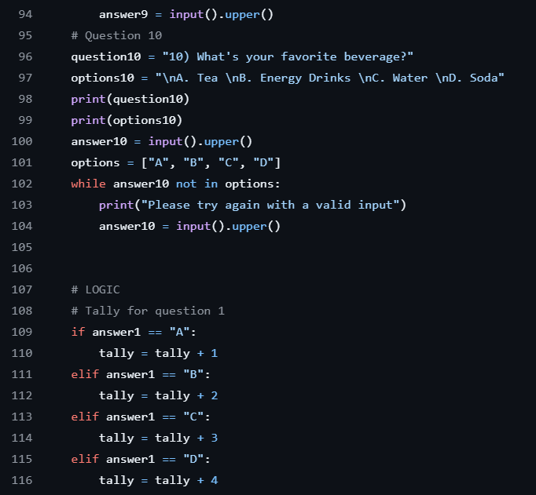

# CS105/6/7/8 Portfolio
# Emily Pickett
## Portfolio
Instagram: @emilypickett065
## About Me 
Hello! I am an experienced Psychologist and info systems professional with over 2 years of proven expertise in Psychology and information systems. 
 
With skills in data collection, organizing, presenting, and conveying findings. I am able to analyze and organize data and achieve data organization and understanding. I am adept at using Excel, Word, and Python. 
 
My analytic skill set, commitment to reliability, and passion for Psychology and information systems make me a valuable asset.  In my spare time, I like to travel and play the violin. 

## Education 
1st year student, Loyola University, Psychology Major
***
### Projects

## Grade Calculator
For this project I wanted to find a way to organize what will be graded in your course as well as giving you instant grading. (Very helpful if your professor doesn’t put grades in Moodle!) I mostly used the lessons from Mr. John as well as the videos made for that week to help me with formulas. The biggest challenge for me was trying to figure out how each of the formulas worked together. What I mean by this is how I could put in a score and then the main grade would accumulate and change accordingly. In the end I was able to create a working and accurate calculator for the two classes I chose. If I were to do this again, I would try to add more specific grades like A- or A+ so students will get an even more accurate representation of their grades.

[Gradebook]()
***
## Python Gradebook
Similarly to the grade calculator on Excel, this is also a grade calculator, but instead in Python. I wanted to allow students to put in grade values and in return get the weighted and unweighted grade average. Overall, this project gives more in-depth answers compared to the Excel calculator. Again, I mostly used the lectures from Mr. John as well as the videos in the module. My biggest challenge was trying to remember that every aspect of what I wanted to be produced had to have a certain code associated with it. In Excel, the functions would work more independently whereas is Python you would have to tell the computer that the input was a number and if you didn’t then you wouldn’t get the answer you’re looking for. I was able to create a working grade calculator that gives an in-depth analysis of your grades both weighted and unweighted. If I were to do this over again, I would work on condensing my code so it is more efficient and easier to read.

 - Project 2 Report
***
## Python Personality test
For the final project the main goal was to create a personality test in Python. This test is a fun activity to do when you’re just looking for a mindless activity. I used the lessons from Mr. John as well as looking back at other videos from past modules to help me with this project. In order to help me with the questions as well as responses, I utilized the internet as well as some Ai to help guide me through my options. My biggest challenge was the ample amount of code and trying to go through it all to make sure it is functioning properly. It was also a challenge to figure out how the input from the user will impact which personality they will get. In the end I created a working personality test that will give you a different result based on what answers the user chooses. If I were to do this again like in the week 3 project, I would want to simplify the code so it’s easier to read and understand. I also think this personality test would benefit with a more thought out approach to the final results and the ranges that decide the personality.

 - Project 3 Report
